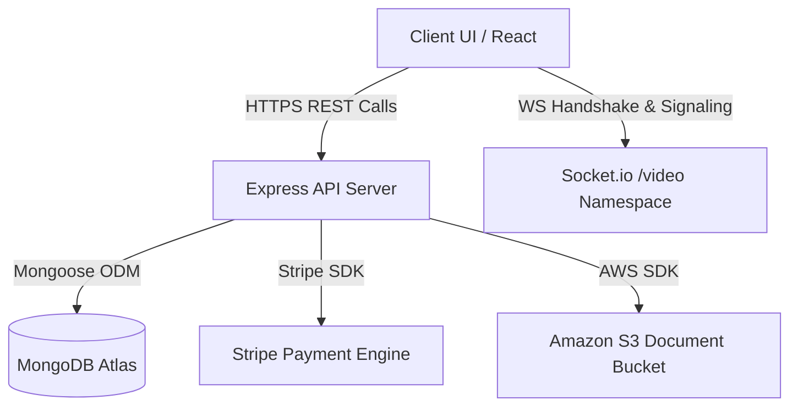
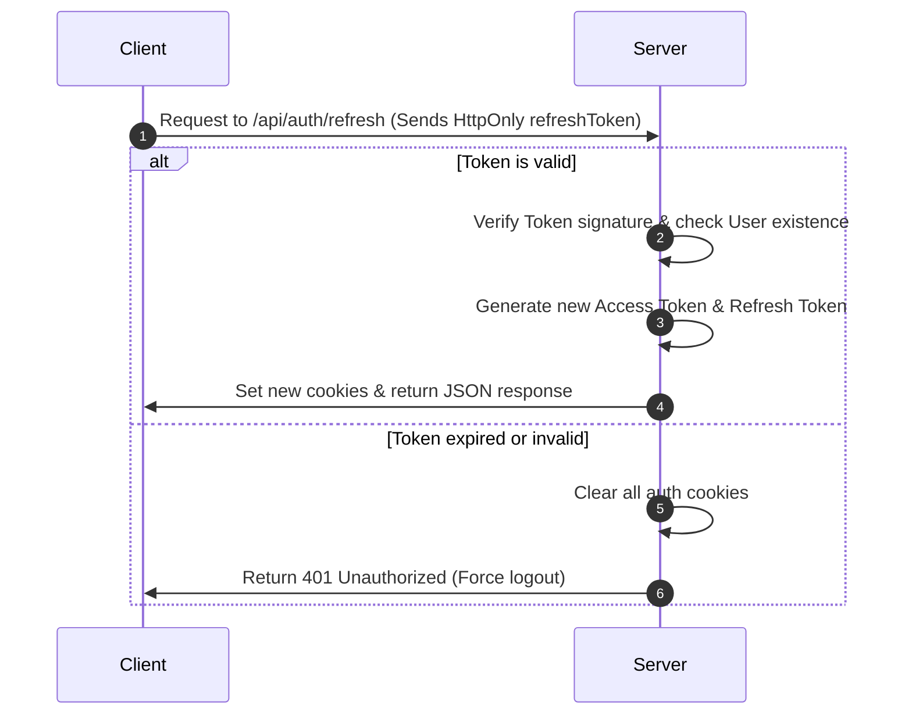
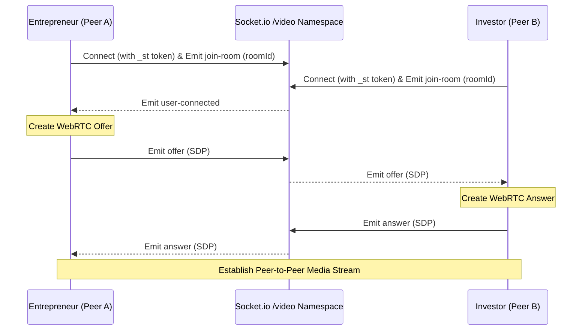

# Nexus Platform API Documentation

Welcome to the official API documentation for the Nexus Platform backend. This reference describes all REST endpoints, WebSocket events, security mechanisms, and environment configurations.

---

# TABLE OF CONTENTS
1. [Overview](#1-overview)
2. [Base Configuration](#2-base-configuration)
3. [Authentication & Cookies](#3-authentication--cookies)
4. [Error Handling & Status Codes](#4-error-handling--status-codes)
5. [Rate Limiting](#5-rate-limiting)
6. [Security Headers](#6-security-headers)
7. [Core Endpoints (Week 1)](#7-core-endpoints-week-1)
   - [Authentication Routes](#authentication-routes)
   - [Profile Routes](#profile-routes)
   - [Dashboard Routes](#dashboard-routes)
8. [Collaboration Endpoints (Week 2)](#8-collaboration-endpoints-week-2)
   - [Meeting Scheduling Routes](#meeting-scheduling-routes)
   - [Document Chamber Routes](#document-chamber-routes)
9. [Payment & Security Endpoints (Week 3)](#9-payment--security-endpoints-week-3)
   - [Payment Routes](#payment-routes)
   - [Stripe Webhook](#stripe-webhook)
   - [Security & 2FA Routes](#security--2fa-routes)
10. [WebSocket Events (Video Calling)](#10-websocket-events-video-calling)
11. [Environment Variables](#11-environment-variables)
12. [Example Postman Collection Structure](#12-example-postman-collection-structure)

---

## 1. OVERVIEW

The Nexus API provides a highly secure, enterprise-grade, RESTful backend with real-time video signaling capabilities via WebSockets. It acts as the orchestration layer for:
- **Secured Role-Based Dashboards**: Separating views and privileges for Investors and Entrepreneurs.
- **Dynamic Scheduling**: Allowing users to propose, accept, conflict-detect, and schedule calendar syncs.
- **Document Chamber**: Relaying agreements (PDF/DOCX/Images) securely to Amazon AWS S3 or a local fallback filesystem, with digital signature capture.
- **Stripe Wallet Ledgers**: Processing secure deposits and withdrawals, as well as direct peer-to-peer wallet transfers with high-precision ledger audit trails (calculated in cents).
- **WebRTC Conference Signaling**: Establishing direct peer-to-peer audio and video rooms via Socket.io.



---

## 2. BASE CONFIGURATION

- **Local Development base URL**: `http://localhost:5000/api`
- **Production base URL**: `https://nexus-platform-main.onrender.com/api`
- **Swagger Documentation URL**: `/api/docs` (served via Swagger UI)
- **CORS Configuration**: CORS is configured to accept requests strictly from the client origin specified in the `CLIENT_URL` environment variable (e.g., `http://localhost:3000`), with `credentials: true` to support HTTPOnly cookies.
- **HTTPS Enforcer**: In production mode, all HTTP requests are redirected automatically (301 Moved Permanently) to HTTPS using standard `x-forwarded-proto` header parsing.

---

## 3. AUTHENTICATION & COOKIES

Authentication is cookie-based and uses dual JSON Web Tokens (JWT) to protect against Cross-Site Scripting (XSS) and Cross-Site Request Forgery (CSRF).

### Hashed Credentials
Passwords are secure, hashed server-side using `bcryptjs` with **12 salt rounds**.

### Token and Cookie Specifications
When a user registers, logs in, or completes 2FA verification, the server issues four separate cookies to the client response:

| Cookie Name | Purpose | Scope | httpOnly | maxAge | sameSite |
| :--- | :--- | :--- | :--- | :--- | :--- |
| `accessToken` | Access Token containing `{ id, role }` | API Authentication | `true` | 15 min | `none` (Prod) / `strict` (Dev) |
| `refreshToken` | Refresh Token containing `{ id, role }` | Token Rotation | `true` | 7 days | `none` (Prod) / `strict` (Dev) |
| `jwtPayload` | Base64 representation of `{ id, name, role }` | Client UI Parsing | `false` | 15 min | `none` (Prod) / `strict` (Dev) |
| `_st` | WebSocket Token containing `{ id, role }` | Socket.io Connection Auth | `false` | 15 min | `none` (Prod) / `strict` (Dev) |

> [!NOTE]
> Setting `sameSite` to `'none'` in production is necessary to permit cross-domain credentials on hosted services (Vercel to Render).
> Standard logout requests clear all four cookies from the browser, explicitly passing identical security settings to ensure clean removal.

### Token Rotation Flow



---

## 4. ERROR HANDLING & STATUS CODES

All errors are returned in a clean JSON format. The system makes a distinction between validation errors and business logic/unhandled errors.

### Validation Errors (Status: `422 Unprocessable Entity`)
Whenever a request body fails structural or field-level validation (managed by `express-validator`), the server rejects it with a `422` status and returns an audit list.
- **Response Format**:
```json
{
  "message": "field_name: Error message, another_field: Error message2",
  "errors": [
    {
      "type": "field",
      "value": "invalid_value",
      "msg": "Error message details",
      "path": "field_name",
      "location": "body"
    }
  ]
}
```

### Business Logic & Server Errors
For logic validation failures, authorization issues, or unhandled exceptions, the server replies with a single descriptive message.
- **Response Format**:
```json
{
  "message": "Descriptive error message outlining what went wrong."
}
```

### HTTP Status Codes Quick Reference

- **`200 OK`**: Request succeeded. Returns the expected resource or a status message.
- **`201 Created`**: Resource created successfully (e.g., successful user registration, document upload).
- **`400 Bad Request`**: Malformed payload, invalid logic inputs, or Stripe failures.
- **`401 Unauthorized`**: Authentication failed. The cookie is missing, expired, or holds an invalid signature.
- **`403 Forbidden`**: Resource ownership check failed (`verifyOwnership` check) or wrong user role.
- **`404 Not Found`**: Target resource (user, profile, document, meeting, transaction) does not exist.
- **`409 Conflict`**: Meeting slot double-booking or calendar collision detected.
- **`422 Unprocessable Entity`**: Sanitizer or validator rejected fields in the request body/parameters.
- **`500 Internal Server Error`**: Database error, Stripe integration fault, or internal crash.

---

## 5. RATE LIMITING

To prevent brute force, denial of service, and script-based financial transactions, the backend implements three distinct IP-based rate limiters:

1. **Global API Limiter**:
   - **Limit**: 100 requests per 15 minutes.
   - **Scope**: Applied to all `/api/*` endpoints.
   - **Fail Message**: `Too many requests, please try again after 15 minutes.`
2. **Authentication Limiter**:
   - **Limit**: 10 requests per 15 minutes.
   - **Scope**: Applied to `/api/auth/*` endpoints.
   - **Fail Message**: `Too many login attempts, please try again after 15 minutes.`
3. **Payments Limiter**:
   - **Limit**: 20 requests per hour.
   - **Scope**: Applied to `/api/payments/*` endpoints.
   - **Exemptions**: Explicitly bypasses `/api/payments/webhook` to prevent dropping Stripe callbacks.
   - **Fail Message**: `Too many payment requests, please try again later.`

---

## 6. SECURITY HEADERS

Nexus employs robust security mechanisms to minimize web-based attacks.

### CSP Policies (`helmet`)
Standard Express responses include a customized Content Security Policy (CSP) designed to accommodate the Stripe client library:
- `defaultSrc`: `["'self'"]` (only resource requests from origin domain)
- `scriptSrc`: `["'self'", "https://js.stripe.com"]` (allows Stripe.js script)
- `frameSrc`: `["https://js.stripe.com"]` (allows secure Stripe iframe inputs)
- `connectSrc`: `["'self'", "https://api.stripe.com"]` (allows connections to Stripe APIs)
- `imgSrc`: `["'self'", "data:", "https:"]` (allows inline images and external HTTPS assets)
- `styleSrc`: `["'self'", "'unsafe-inline'"]` (allows style execution)

### Extra Sanitizers
- **NoSQL Injection Block (`express-mongo-sanitize`)**: Strips characters starting with `$` or containing `.` from input queries, parameters, and bodies to stop malicious MongoDB pipeline injection.
- **XSS Stripping (`xss-clean`)**: Recursively sanitizes request body fields, parameters, and query lists of raw HTML script tags.
- **HTTP Parameter Pollution Protection (`hpp`)**: Strips duplicate query strings to prevent parameters parsing array overrides.

---

## 7. CORE ENDPOINTS (WEEK 1)

### Authentication Routes
Endpoints mounted under `/api/auth`. Rate limited to 10 requests per 15 minutes.

#### 1. Register User
Create a new user and automatically initialize an empty Profile and a 0-balance Wallet.
- **HTTP Method & Route**: `POST /api/auth/register`
- **Request Body**:
```json
{
  "name": "Shaheer Mirza",
  "email": "shaheer@example.com",
  "password": "SecurePassword123!",
  "role": "entrepreneur"
}
```
- **Success Response (`201 Created`)**:
```json
{
  "success": true,
  "user": {
    "id": "6483cb2fb4f971b3dc92a188",
    "name": "Shaheer Mirza",
    "role": "entrepreneur"
  }
}
```
*(Sets cookies: `accessToken`, `refreshToken`, `jwtPayload`, `_st`)*

#### 2. Login User
Authenticate credentials. Supports opt-in 2FA logic.
- **HTTP Method & Route**: `POST /api/auth/login`
- **Request Body**:
```json
{
  "email": "shaheer@example.com",
  "password": "SecurePassword123!"
}
```
- **Success Response (`200 OK` - 2FA Disabled)**:
```json
{
  "success": true,
  "user": {
    "id": "6483cb2fb4f971b3dc92a188",
    "name": "Shaheer Mirza",
    "role": "entrepreneur"
  },
  "requires2FA": false
}
```
*(Sets cookies: `accessToken`, `refreshToken`, `jwtPayload`, `_st`)*

- **Success Response (`200 OK` - 2FA Enabled)**:
```json
{
  "requires2FA": true,
  "userId": "6483cb2fb4f971b3dc92a188"
}
```
*(Triggers Nodemailer to send a 6-digit OTP code to the user's email address).*

#### 3. Verify OTP
Validates the OTP code to log the user in after a requires-2FA login check.
- **HTTP Method & Route**: `POST /api/auth/verify-otp`
- **Request Body**:
```json
{
  "userId": "6483cb2fb4f971b3dc92a188",
  "otp": "394857"
}
```
- **Success Response (`200 OK`)**:
```json
{
  "success": true,
  "user": {
    "id": "6483cb2fb4f971b3dc92a188",
    "name": "Shaheer Mirza",
    "role": "entrepreneur"
  }
}
```
*(Sets cookies: `accessToken`, `refreshToken`, `jwtPayload`, `_st`)*

#### 4. Request OTP Manually
Request a fresh OTP code for the user. Used if the previous code expired or was not received.
- **HTTP Method & Route**: `POST /api/auth/request-otp`
- **Request Body**:
```json
{
  "userId": "6483cb2fb4f971b3dc92a188"
}
```
- **Success Response (`200 OK`)**:
```json
{
  "message": "Verification code sent to email."
}
```

#### 5. Logout User
Clears all four auth cookies.
- **HTTP Method & Route**: `POST /api/auth/logout`
- **Success Response (`200 OK`)**:
```json
{
  "success": true,
  "message": "Logged out successfully."
}
```

#### 6. Rotate Tokens
Used automatically by frontend interceptors when access tokens expire.
- **HTTP Method & Route**: `POST /api/auth/refresh`
- **Success Response (`200 OK`)**:
```json
{
  "success": true,
  "message": "Tokens refreshed."
}
```
*(Sets rotated cookies)*

#### 7. Enable Two-Factor Authentication (2FA)
- **HTTP Method & Route**: `POST /api/auth/enable-2fa`
- **Headers**: Requires active cookie authentication
- **Success Response (`200 OK`)**:
```json
{
  "message": "2FA enabled successfully",
  "twoFactorEnabled": true
}
```

#### 8. Disable Two-Factor Authentication (2FA)
- **HTTP Method & Route**: `POST /api/auth/disable-2fa`
- **Headers**: Requires active cookie authentication
- **Success Response (`200 OK`)**:
```json
{
  "message": "2FA disabled successfully",
  "twoFactorEnabled": false
}
```

#### 9. Change Password
Update account password while authenticated.
- **HTTP Method & Route**: `POST /api/auth/change-password`
- **Headers**: Requires active cookie authentication
- **Request Body**:
```json
{
  "currentPassword": "SecurePassword123!",
  "newPassword": "BetterPassword321!"
}
```
- **Success Response (`200 OK`)**:
```json
{
  "message": "Password changed successfully."
}
```

#### 10. Forgot Password
Trigger a password reset link to a registered email.
- **HTTP Method & Route**: `POST /api/auth/forgot-password`
- **Request Body**:
```json
{
  "email": "shaheer@example.com"
}
```
- **Success Response (`200 OK`)**:
```json
{
  "message": "Password reset link sent to email"
}
```

#### 11. Reset Password
Update password using the raw reset token received in the email URL.
- **HTTP Method & Route**: `POST /api/auth/reset-password/:token`
- **Request Body**:
```json
{
  "password": "BetterPassword321!"
}
```
- **Success Response (`200 OK`)**:
```json
{
  "message": "Password reset successful"
}
```

---

### Profile Routes
Endpoints mounted under `/api/profile`. All routes require cookie authentication.

#### 1. Retrieve Own Profile
Returns authenticated user's profile information merged with their user account fields.
- **HTTP Method & Route**: `GET /api/profile/me`
- **Success Response (`200 OK` - Entrepreneur Profile)**:
```json
{
  "_id": "6483cc04b4f971b3dc92a194",
  "userId": "6483cb2fb4f971b3dc92a188",
  "bio": "Building high-performance API architectures.",
  "location": "Dallas, TX",
  "website": "https://nexus-platform.com",
  "startupName": "Nexus Hub",
  "startupStage": "Pre-seed",
  "fundingRequired": 25000000,
  "teamSize": 8,
  "profilePicture": "/uploads/profile-6483cb2f-17809890.png",
  "name": "Shaheer Mirza",
  "email": "shaheer@example.com",
  "role": "entrepreneur",
  "twoFactorEnabled": false
}
```

#### 2. Update Profile
Dynamically updates fields matching the role structure of the user.
- **HTTP Method & Route**: `PUT /api/profile/me`
- **Request Body**:
```json
{
  "bio": "Building high-performance monorepo architectures.",
  "location": "Austin, TX",
  "teamSize": 10
}
```
- **Success Response (`200 OK`)**: Returns updated profile document merged with user details.

#### 3. View Another User's Profile
Read public profile details of another member on the platform.
- **HTTP Method & Route**: `GET /api/profile/:userId`
- **Success Response (`200 OK`)**: Profile document merged with user details.

#### 4. Upload Profile Picture
Upload profile avatar file through a multipart form parse.
- **HTTP Method & Route**: `POST /api/profile/picture`
- **Request Body**: Multipart Form Data
  - `picture`: Image file binary (JPEG/JPG/PNG/GIF/WEBP <= 5MB)
- **Success Response (`200 OK`)**:
```json
{
  "success": true,
  "profilePicture": "/uploads/profile-6483cb2fb4f971b3dc92a188-1780989069445.png"
}
```

---

### Dashboard Routes
Endpoints mounted under `/api`. Requires cookie authentication and matching role.

#### 1. Investor Dashboard Metrics
- **HTTP Method & Route**: `GET /api/investor/dashboard`
- **Role Requirement**: `investor`
- **Success Response (`200 OK`)**:
```json
{
  "success": true,
  "totalInvestments": 4,
  "activeDeals": 0,
  "industriesOfInterest": ["Fintech", "Healthtech", "Web3"],
  "investmentRange": {
    "min": 10000000,
    "max": 50000000
  },
  "meetingsCount": 3
}
```

#### 2. Entrepreneur Dashboard Metrics
- **HTTP Method & Route**: `GET /api/entrepreneur/dashboard`
- **Role Requirement**: `entrepreneur`
- **Success Response (`200 OK`)**:
```json
{
  "success": true,
  "startupName": "Nexus Hub",
  "startupStage": "Pre-seed",
  "fundingRequired": 25000000,
  "pitchDeckUrl": "https://nexus-s3.s3.amazonaws.com/decks/pitch.pdf",
  "teamSize": 10,
  "meetingsCount": 2
}
```

---

## 8. COLLABORATION ENDPOINTS (WEEK 2)

### Meeting Scheduling Routes
Endpoints mounted under `/api/meetings`. All routes require cookie authentication.

#### 1. Retrieve User Meetings
Lists all meetings where the authenticated user is either the organizer or invitee.
- **HTTP Method & Route**: `GET /api/meetings/my`
- **Success Response (`200 OK`)**:
```json
[
  {
    "_id": "6483d939b4f971b3dc92a2a0",
    "title": "Investment Pitch Review",
    "description": "Walkthrough of startup milestones and Stripe integrations.",
    "organizer": {
      "_id": "6483cb2fb4f971b3dc92a188",
      "name": "Shaheer Mirza",
      "email": "shaheer@example.com"
    },
    "invitee": {
      "_id": "6483cfa5b4f971b3dc92a210",
      "name": "Jane Investor",
      "email": "jane@nexus.com"
    },
    "proposedTimes": [
      {
        "startTime": "2026-06-15T15:00:00.000Z",
        "endTime": "2026-06-15T16:00:00.000Z",
        "_id": "6483d939b4f971b3dc92a2a1"
      }
    ],
    "status": "pending",
    "notes": "Let me know if this slot works.",
    "createdAt": "2026-06-09T22:30:00.000Z"
  }
]
```

#### 2. Get Date-Range Meetings
Fetch accepted, completed, or pending meetings within a specific calendar start and end range.
- **HTTP Method & Route**: `GET /api/meetings/calendar`
- **Query Parameters**:
  - `start`: ISO8601 Date String
  - `end`: ISO8601 Date String
- **Success Response (`200 OK`)**: Array of meeting documents overlapping the date parameters.

#### 3. Get Single Meeting Details
Fetch detailed meeting information.
- **HTTP Method & Route**: `GET /api/meetings/:id`
- **Access Control**: Validates that req.user is either the organizer or the invitee of the meeting. Returns `403 Forbidden` if ownership matches fail.

#### 4. Propose/Schedule Meeting
Propose a meeting structure containing one or more possible time slots.
- **HTTP Method & Route**: `POST /api/meetings/schedule`
- **Request Body**:
```json
{
  "title": "Nexus Integration Deep-dive",
  "description": "Solving remaining socket and webhook fallbacks.",
  "invitee": "6483cfa5b4f971b3dc92a210",
  "proposedTimes": [
    {
      "startTime": "2026-06-16T10:00:00Z",
      "endTime": "2026-06-16T11:00:00Z"
    }
  ],
  "notes": "Looking forward to speaking."
}
```
- **Success Response (`201 Created`)**: Scheduled meeting object.

#### 5. Accept Meeting Proposal
Accept the meeting by selecting and confirming one of the organizer's proposed slots.
- **HTTP Method & Route**: `PUT /api/meetings/:id/accept`
- **Access Control**: Limited strictly to the `invitee` (`verifyOwnership` middleware check).
- **Request Body**:
```json
{
  "confirmedTime": {
    "startTime": "2026-06-16T10:00:00Z",
    "endTime": "2026-06-16T11:00:00Z"
  }
}
```
- **Success Response (`200 OK`)**:
```json
{
  "_id": "6483d939b4f971b3dc92a2a0",
  "title": "Nexus Integration Deep-dive",
  "status": "accepted",
  "confirmedTime": {
    "startTime": "2026-06-16T10:00:00.000Z",
    "endTime": "2026-06-16T10:00:00.000Z"
  },
  "meetingLink": "a576db84-884c-47e1-88f3-8f08149eb0f3"
}
```
*(Generates a unique WebRTC UUID `meetingLink` room string).*

> [!CAUTION]
> **Conflict Overlaps**: This endpoint performs database conflict checks. If either user has an overlapping confirmed meeting, it returns `409 Conflict` containing the name of the overlapping meeting and its times.

#### 6. Reject Meeting
Reject the meeting slot proposal.
- **HTTP Method & Route**: `PUT /api/meetings/:id/reject`
- **Access Control**: Limited strictly to the `invitee`.
- **Request Body**:
```json
{
  "notes": "No slots work. Can you propose new ones next week?"
}
```
- **Success Response (`200 OK`)**: Meeting object with `status` set to `'rejected'`.

#### 7. Cancel Meeting
Cancel an scheduled meeting.
- **HTTP Method & Route**: `PUT /api/meetings/:id/cancel`
- **Access Control**: Limited strictly to the `organizer` (`verifyOwnership` check).
- **Success Response (`200 OK`)**: Meeting object with `status` set to `'cancelled'`.

---

### Document Chamber Routes
Endpoints mounted under `/api/documents`. All routes require cookie authentication.

#### 1. Upload Document
Upload agreement files (max 10MB) to cloud AWS S3 storage (or server `/uploads` fallback path).
- **HTTP Method & Route**: `POST /api/documents/upload`
- **Request Body**: Multipart Form Data
  - `file`: Document binary (PDF/DOCX/PNG/JPG <= 10MB)
  - `title`: "Partnership NDA Draft"
  - `description`: "Standard non-disclosure agreement."
  - `tags`: "legal, milestone1"
- **Success Response (`201 Created`)**:
```json
{
  "_id": "6483e05bb4f971b3dc92a3b2",
  "title": "Partnership NDA Draft",
  "description": "Standard non-disclosure agreement.",
  "uploadedBy": "6483cb2fb4f971b3dc92a188",
  "sharedWith": [],
  "fileUrl": "/uploads/58a69e38-4e8c-4a37-97fd-c77e4cfd55cf.pdf",
  "fileName": "Partnership NDA Draft.pdf",
  "fileSize": 182745,
  "fileType": "application/pdf",
  "version": 1,
  "status": "draft",
  "tags": ["legal", "milestone1"]
}
```

#### 2. Get Documents List
Lists documents uploaded by the authenticated user or explicitly shared with them.
- **HTTP Method & Route**: `GET /api/documents/my`
- **Success Response (`200 OK`)**: Array of document metadata objects.

#### 3. Share Document
Share document read access with another user.
- **HTTP Method & Route**: `PUT /api/documents/:id/share`
- **Access Control**: Restricted strictly to the owner who uploaded the document (`verifyOwnership` check).
- **Request Body**:
```json
{
  "userId": "6483cfa5b4f971b3dc92a210"
}
```
- **Success Response (`200 OK`)**: Updated document metadata.

#### 4. Update Document Status
Directly update status workflows of a shared document.
- **HTTP Method & Route**: `PUT /api/documents/:id/status`
- **Request Body**:
```json
{
  "status": "under_review"
}
```
*(Status must be one of: `draft`, `under_review`, `signed`, `archived`)*
- **Success Response (`200 OK`)**: Updated document metadata.

#### 5. E-Sign Document
Attach a base64 digital signature to the document and transition its status to `'signed'`.
- **HTTP Method & Route**: `POST /api/documents/:id/sign`
- **Request Body**:
```json
{
  "signatureImage": "data:image/png;base64,iVBORw0KGgoAAAANS..."
}
```
- **Success Response (`200 OK`)**:
```json
{
  "_id": "6483e05bb4f971b3dc92a3b2",
  "title": "Partnership NDA Draft",
  "status": "signed",
  "signature": {
    "signedBy": "6483cfa5b4f971b3dc92a210",
    "signatureImageUrl": "/uploads/sig_93bd8c7e-8c34.png",
    "signedAt": "2026-06-09T22:50:00.000Z"
  }
}
```

#### 6. Retrieve Document File Binary
Allows downloading the secure document.
- **HTTP Method & Route**: `GET /api/documents/:id/download`
- **Access Control**: Validates that req.user is the owner or part of the `sharedWith` group.
- **Success Response**: Returns binary file stream (local uploads fallback path) or redirects (302 Redirect) to a secure pre-signed Amazon S3 URL valid for 60 seconds.

#### 7. Archive (Soft Delete) Document
Soft-deletes a document by marking its status as archived.
- **HTTP Method & Route**: `DELETE /api/documents/:id`
- **Access Control**: Restricted strictly to the document owner.
- **Success Response (`200 OK`)**:
```json
{
  "message": "Document archived successfully.",
  "document": { ... }
}
```

---

## 9. PAYMENT & SECURITY ENDPOINTS (WEEK 3)

### Payment Routes
Endpoints mounted under `/api/payments`. All routes (except webhook) require cookie authentication.

#### 1. Create Stripe PaymentIntent
Obtains a Stripe clientSecret to mount the card input element on the frontend. Automatically saves a pending deposit record.
- **HTTP Method & Route**: `POST /api/payments/create-intent`
- **Request Body**:
```json
{
  "amount": 10000
}
```
*(Amount defined in cents: `10000` = $100.00)*
- **Success Response (`200 OK`)**:
```json
{
  "clientSecret": "pi_3M2h..._secret_...",
  "stripePaymentIntentId": "pi_3M2h..."
}
```

#### 2. Confirm Wallet Deposit
Confirm a successful payment on the server. Checks the intent directly from Stripe, increments the user's wallet, and sets the transaction status to `'completed'`.
- **HTTP Method & Route**: `POST /api/payments/deposit`
- **Request Body**:
```json
{
  "stripePaymentIntentId": "pi_3M2h..."
}
```
- **Success Response (`200 OK`)**:
```json
{
  "message": "Deposit successful",
  "balance": 10000
}
```

#### 3. Reconcile Transaction Fallback
Syncs a transaction's status directly with Stripe API. Used as a fallback check in case of webhook latency.
- **HTTP Method & Route**: `POST /api/payments/confirm/:intentId`
- **Success Response (`200 OK`)**:
```json
{
  "status": "completed",
  "transaction": {
    "_id": "6483ec0ab4f971b3dc92a401",
    "stripePaymentIntentId": "pi_3M2h...",
    "status": "completed",
    "amount": 10000,
    "type": "deposit"
  }
}
```

#### 4. Withdraw Wallet Balance
Deducts funds from the user's wallet balance (simulating a bank transfer).
- **HTTP Method & Route**: `POST /api/payments/withdraw`
- **Request Body**:
```json
{
  "amount": 5000
}
```
*(Withdraws $50.00 in cents)*
- **Success Response (`200 OK`)**:
```json
{
  "message": "Withdrawal successful",
  "balance": 5000
}
```

#### 5. Wallet-to-Wallet Transfer
Executes a direct peer transfer from the authenticated user's wallet to another user's wallet using their email.
- **HTTP Method & Route**: `POST /api/payments/transfer`
- **Request Body**:
```json
{
  "recipientEmail": "shaheer@example.com",
  "amount": 2500
}
```
- **Success Response (`200 OK`)**:
```json
{
  "message": "Transfer successful",
  "balance": 2500
}
```
> [!NOTE]
> This creates two transaction records: a debit entry (`type: "transfer"`) detailing the target for the sender, and a credit entry for the recipient.

#### 6. Check Balance
- **HTTP Method & Route**: `GET /api/payments/balance`
- **Success Response (`200 OK`)**:
```json
{
  "balance": 2500
}
```

#### 7. Audit Transaction History
Retrieves all transaction logs (deposits, withdrawals, and transfers) sorted newest first.
- **HTTP Method & Route**: `GET /api/payments/history`
- **Success Response (`200 OK`)**:
```json
[
  {
    "type": "transfer",
    "amount": 2500,
    "status": "completed",
    "description": "Transfer to Shaheer Mirza (shaheer@example.com)",
    "createdAt": "2026-06-09T23:00:00.000Z"
  }
]
```

---

### Stripe Webhook
Receives real-time asynchronous callbacks directly from Stripe servers to reconcile deposits.

- **HTTP Method & Route**: `POST /api/payments/webhook`
- **Rate Limiting**: Exempted from payment-related limits.
- **Headers Requirement**: Requires `stripe-signature` header payload verification.
- **Request Body**: Parses raw buffer stream.
- **Event Types Handled**:
  - `payment_intent.succeeded`: Reconciles MDB transaction to `'completed'` and increments the user's wallet balance.
  - `payment_intent.payment_failed`: Marks MDB transaction as `'failed'`.

---

### Security & 2FA Routes
Dual factor setup routes. See the [Authentication Routes](#authentication-routes) group details for:
- `POST /api/auth/enable-2fa`
- `POST /api/auth/disable-2fa`
- `POST /api/auth/request-otp`
- `POST /api/auth/verify-otp`

---

## 10. WEBSOCKET EVENTS (VIDEO CALLING)

Real-time audio-video signaling is hosted via Socket.io under the `/video` namespace. 

### Connection Auth
Establishing connections requires token authentication inside socket headers. The middleware reads the token value from:
1. `socket.handshake.auth.token` (Primary: passes the value of `_st` cookie).
2. `socket.handshake.headers.cookie` (Fallback: parses `accessToken` or `_st`).

### Signaling Architecture



### Event Manifest

#### Client-to-Server (Emit)
- **`join-room`**: `(roomId, userId)` - Registers a client connection to a room. 
  - *Limit*: The namespace limits rooms to a maximum of 2 participants. Connecting a 3rd socket triggers a `'room-full'` return event.
- **`offer`**: `(offer, roomId)` - Relays a WebRTC Session Description (SDP offer) to the remote peer.
- **`answer`**: `(answer, roomId)` - Relays WebRTC Session Description (SDP answer) to the remote peer.
- **`ice-candidate`**: `(candidate, roomId)` - Relays an ICE candidate structure to the remote peer to establish network pathways.
- **`leave-room`**: `(roomId)` - Notifies the room that this user is leaving.

#### Server-to-Client (Listen)
- **`room-full`**: Sent to the connecting socket if they try to join an active signaling room that already has 2 connections.
- **`user-connected`**: `(socketId)` - Sent to the first peer in the room when the second peer successfully joins. This event triggers the creation of the local SDP Offer.
- **`offer`**: `(offer, senderSocketId)` - Relays SDP offer details to the answering peer.
- **`answer`**: `(answer, senderSocketId)` - Relays SDP answer details back to the offering peer to establish Webrtc pathways.
- **`ice-candidate`**: `(candidate, senderSocketId)` - Relays network pathway structures.
- **`peer-disconnected`**: `(socketId)` - Sent to the remaining peer when the remote peer disconnects or leaves the room.

---

## 11. ENVIRONMENT VARIABLES

The following variables must be configured in `server/.env` for correct execution:

| Variable Name | Required? | Purpose / Description | Default / Example Value |
| :--- | :--- | :--- | :--- |
| `PORT` | Optional | Specifies port backend server listens on. | `5000` |
| `NODE_ENV` | Required | Set to `'production'` or `'development'`. Controls secure cookie options. | `development` |
| `MONGO_URI` | Required | MongoDB Atlas or local connection string. | `mongodb://localhost:27017/nexus` |
| `JWT_SECRET` | Required | Cryptographic secret for signing JWT Access Cookies. | `your_jwt_access_secret_here` |
| `JWT_REFRESH_SECRET` | Required | Cryptographic secret for signing JWT Refresh Cookies. | `your_jwt_refresh_secret_here` |
| `CLIENT_URL` | Required | Client frontend URL. Configures CORS and reset password emails. | `http://localhost:3000` |
| `STRIPE_PUBLIC_KEY` | Required | Stripe Sandboxed Public API Key. | `pk_test_...` |
| `STRIPE_SECRET_KEY` | Required | Stripe Sandboxed Secret API Key. | `sk_test_...` |
| `STRIPE_WEBHOOK_SECRET`| Required | Stripe Webhook signature verification key. | `whsec_...` |
| `EMAIL_SERVICE` | Required | Email notifier client provider. | `gmail` or `ethereal` |
| `EMAIL_USER` | Required | Credentials username for notifications SMTP client. | `example@gmail.com` |
| `EMAIL_PASS` | Required | Password/App-password for SMTP client auth. | `xxxx xxxx xxxx xxxx` |
| `AWS_ACCESS_KEY` | Optional | Amazon S3 credential key. If missing, uploads fallback to server filesystem. | `your_aws_access_key` |
| `AWS_SECRET_KEY` | Optional | Amazon S3 secret key. If missing, uploads fallback to server filesystem. | `your_aws_secret_key` |
| `AWS_BUCKET_NAME` | Optional | AWS S3 Bucket ID. | `nexus-bucket-prod` |
| `AWS_REGION` | Optional | S3 Data storage region. | `us-east-1` |
| `UPLOAD_PATH` | Optional | Folder location used if server falls back to local uploads. | `uploads` |

---

## 12. EXAMPLE POSTMAN COLLECTION STRUCTURE

An export of the comprehensive Postman Collection config is located in the repository at [/docs/nexus.postman_collection.json](file:///c:/Users/Shahe/OneDrive/Documents/Projects/In_Progress/nexus-platform-main/docs/nexus.postman_collection.json).

### Collection Folder Tree Hierarchy
```
Nexus API Collection/
├── Auth/
│   ├── POST Register User           -> /api/auth/register
│   ├── POST Login User              -> /api/auth/login
│   ├── POST Logout User             -> /api/auth/logout
│   ├── POST Refresh Tokens          -> /api/auth/refresh
│   ├── POST Enable 2FA              -> /api/auth/enable-2fa
│   ├── POST Disable 2FA             -> /api/auth/disable-2fa
│   ├── POST Request OTP (2FA Mock)  -> /api/auth/request-otp
│   ├── POST Verify OTP (2FA Mock)   -> /api/auth/verify-otp
│   ├── POST Change Password         -> /api/auth/change-password
│   ├── POST Forgot Password         -> /api/auth/forgot-password
│   └── POST Reset Password          -> /api/auth/reset-password/:token
├── Profile/
│   ├── GET Get Own Profile          -> /api/profile/me
│   ├── PUT Update Own Profile       -> /api/profile/me
│   └── GET Get Another User Profile -> /api/profile/:userId
├── Meetings/
│   ├── POST Schedule Meeting        -> /api/meetings/schedule
│   ├── GET Get My Meetings          -> /api/meetings/my
│   ├── GET Calendar Range Meetings  -> /api/meetings/calendar?start=...&end=...
│   ├── GET Get Single Meeting       -> /api/meetings/:id
│   ├── PUT Accept Meeting           -> /api/meetings/:id/accept
│   ├── PUT Reject Meeting           -> /api/meetings/:id/reject
│   └── PUT Cancel Meeting           -> /api/meetings/:id/cancel
├── Documents/
│   ├── GET Get My Documents         -> /api/documents/my
│   ├── GET Get Single Document      -> /api/documents/:id
│   ├── PUT Share Document           -> /api/documents/:id/share
│   ├── PUT Update Document Status   -> /api/documents/:id/status
│   ├── POST Sign Document           -> /api/documents/:id/sign
│   ├── DELETE Archive Document      -> /api/documents/:id
│   └── GET Download Document        -> /api/documents/:id/download
└── Payments/
    ├── POST Create Stripe Payment   -> /api/payments/create-intent
    ├── GET Get Wallet Balance       -> /api/payments/balance
    ├── GET Get Transaction History  -> /api/payments/history
    ├── POST Withdraw Funds          -> /api/payments/withdraw
    └── POST Peer Transfer Funds     -> /api/payments/transfer
```

### Collection Variables Configuration
The collection is configured with default local variables. Configure a Postman Environment containing these variables:
- `base_url`: Target URL of the backend service (e.g. `http://localhost:5000` or `https://nexus-platform-main.onrender.com`).
- `user_id`: Holds the ID of the current authenticated user (dynamic test mapping).
- `recipient_user_id`: Target user ID when testing transfer, sharing, or meeting schedule functions.
- `meeting_id`: ID of a created meeting, used for accept, reject, or cancel endpoints.
- `document_id`: ID of a uploaded document, used for share, sign, status, download, or archive endpoints.
- `reset_token`: Raw token string received from forgot password flow to reset passwords.
